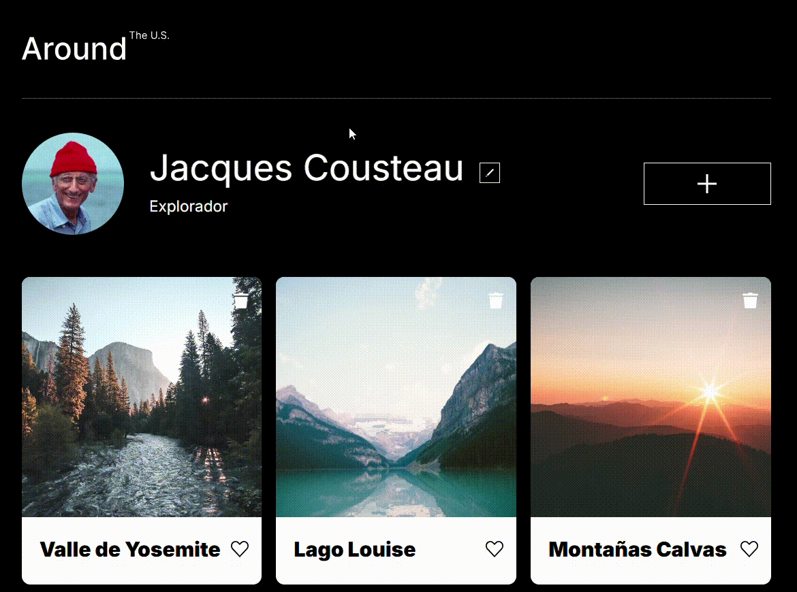
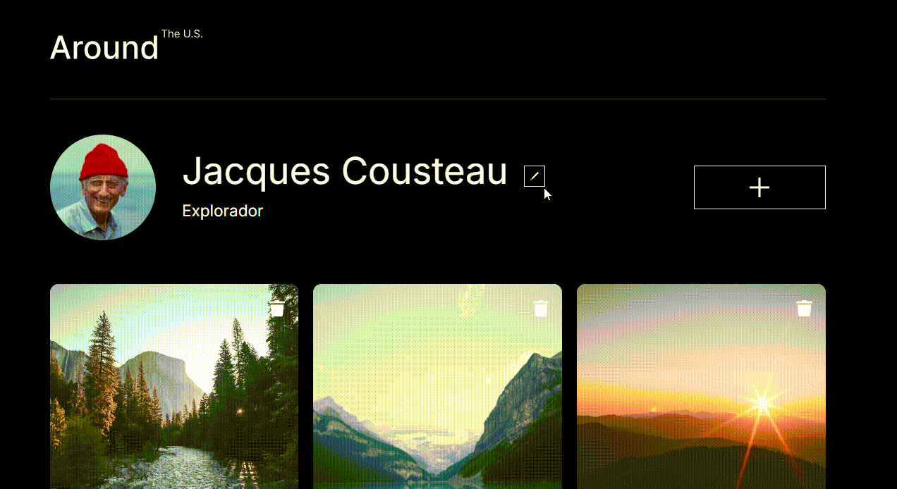
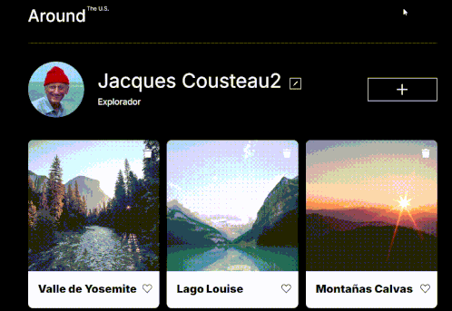

# Tripleten web_project_around

## 📄 Descripción

Este proyecto es una página web donde la interfaz simula un perfil de usuario donde se pueden editar datos personales y gestionar una galería de tarjetas (fotos). El diseño es responsivo y está enfocado en aplicar buenas prácticas de uso de CSS, JavaScript y organización de archivos siguiendo una estructura modular.

## ⚙️ Funcionalidad

### 👤 Perfil de usuario

- Editar nombre y ocupación mediante un formulario emergente.
- Actualización inmediata del perfil en la interfaz al enviar el formulario.

### 🖼️ Galería de tarjetas

- Visualizar una galería de tarjetas con título e imagen representando distintos lugares.
- Agregar nuevas tarjetas mediante un formulario emergente, con validación básica.
- Las tarjetas nuevas se insertan dinámicamente en la parte superior del grid.

### 💬 Interacciones en tarjetas

- Dar "like" a una tarjeta (con cambio visual de estado activo).
- Eliminar tarjetas del grid sin recargar la página.
- Ampliar la imagen de una tarjeta al hacer clic, usando un popup de vista previa.

### 💡 Experiencia de usuario

- Diseño completamente responsive para dispositivos móviles y escritorio.
- Interacciones visuales mediante efectos hover y transiciones suaves.
- Envío de formularios posible también con la tecla Enter desde cualquier campo activo.
- Los formularios son validados manualmente y muestran errores en input invalidos.
- Utiliza manejo de eventos para crear y eliminar controladores cuando se requieren.

## 🛠️ Tecnologías utilizadas

- **HTML5** — estructura semántica del sitio.
- **CSS3** — diseño responsivo, Flexbox, Grid, BEM methodology.
- **JavaScript (Vanilla JS)** — interacción dinámica con el DOM.
- **Git** — control de versiones.
- **Normalize.css** — para asegurar consistencia entre navegadores.

## 🖥️ Demo Visual

### 📄 Vista general

Muestra la pantalla principal de la aplicación con el perfil del usuario y la galería de tarjetas. Cada tarjeta representa un lugar y contiene opciones para visualizar, dar like o eliminar.

### ✏️ Editar perfil

Demuestra cómo el usuario puede editar su nombre y ocupación desde un formulario emergente. Al hacer clic en el ícono de edición, se abre un popup que permite modificar y guardar los datos.

### ➕ Nuevo lugar

Permite agregar una nueva tarjeta a la galería. El usuario introduce el nombre del lugar y el enlace de una imagen. Al enviar el formulario, la nueva tarjeta aparece en la parte superior.

### 💬 Interacciones de tarjeta

Muestra las funcionalidades disponibles en cada tarjeta: dar "like" (activando un ícono visual), eliminar la tarjeta del grid y visualizar la imagen en pantalla completa mediante un popup

## Enlace a GitHub Pages

URL: https://hcarloscb.github.io/web_project_around/index.html
