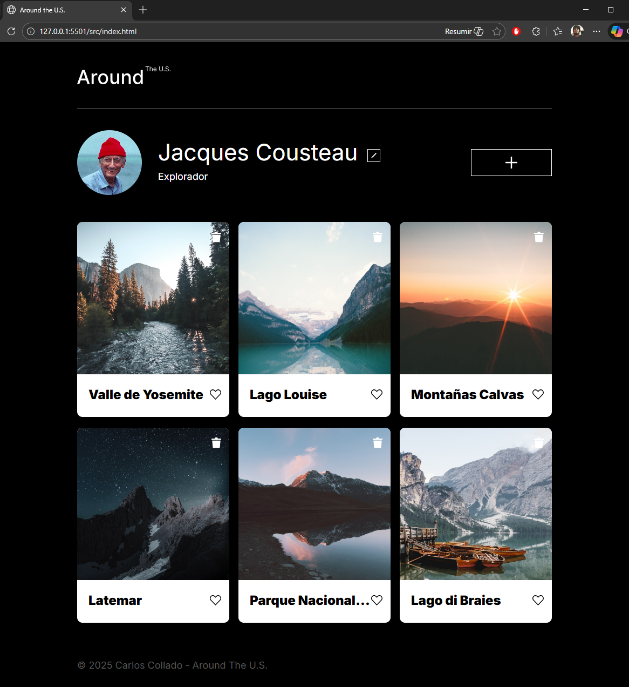
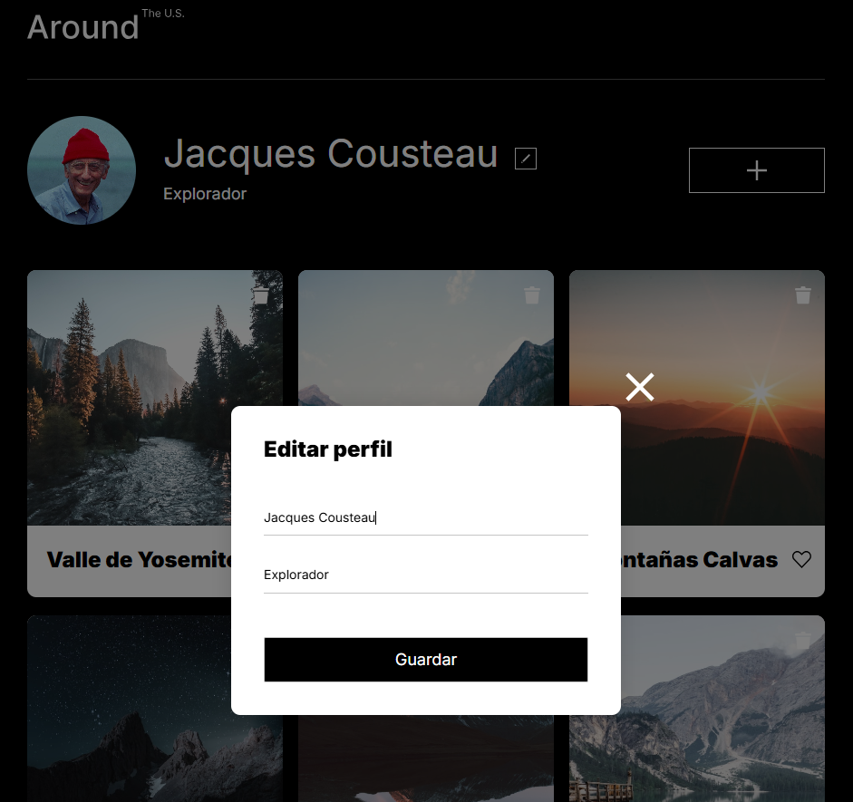
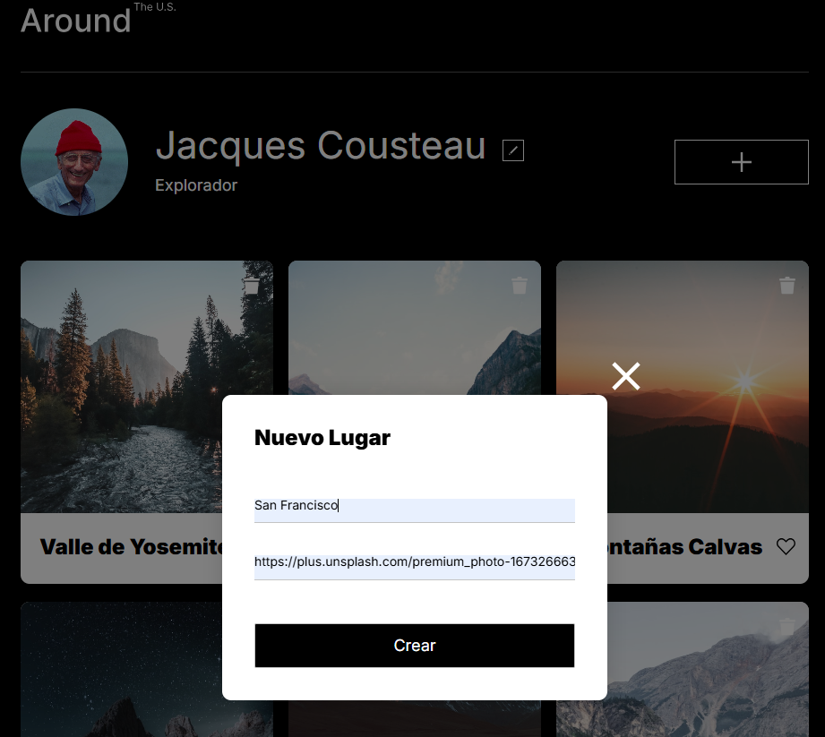
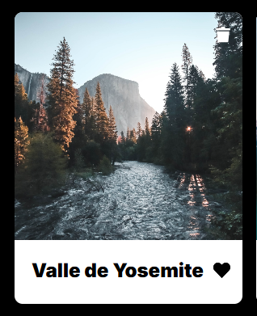
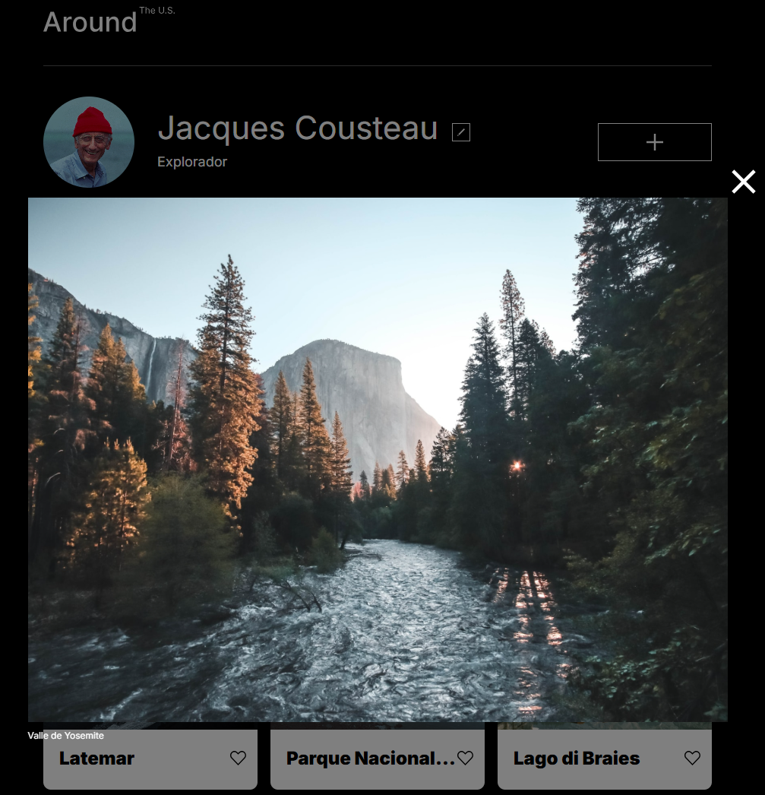
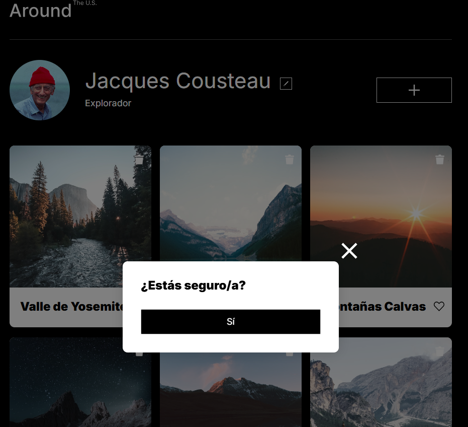

# Tripleten web_project_around

## 📄 Descripción

Este proyecto es una aplicación web con una interfaz tipo perfil de usuario, donde es posible editar información personal y gestionar una galería de tarjetas (fotografías). El diseño es responsivo y el código está modularizado siguiendo buenas prácticas de HTML, CSS y JavaScript.
La aplicación está desarrollada utilizando **Programación Orientada a Objetos (POO)**, con una arquitectura basada en clases reutilizables para manejar tarjetas, formularios, popups y la comunicación con una **API REST**, permitiendo la persistencia de datos en el servidor.

## ⚙️ Funcionalidad

### 👤 Perfil de usuario

- Carga inicial de la información del usuario desde el servidor.
- Edición del nombre y la ocupación mediante un popup con formulario.
- Actualización de la foto de perfil (avatar).
- Sincronización inmediata de los cambios en la interfaz tras recibir la respuesta del servidor.

### 🖼️ Galería de tarjetas

- Carga de tarjetas iniciales desde la API.
- Visualización de tarjetas con imagen y título.
- Agregar nuevas tarjetas mediante un formulario emergente.
- Las tarjetas nuevas se insertan dinámicamente en la parte superior del grid.

### 💬 Interacciones en tarjetas

- Dar y quitar "like" a una tarjeta, con persistencia en el servidor.
- Renderizado correcto del estado de "like" al recargar la página.
- Eliminación de tarjetas mediante un popup de confirmación.
- Eliminación de tarjetas tanto en el servidor como en el DOM sin recargar la página.
- Vista ampliada de imágenes al hacer clic en una tarjeta.

### 💡 Experiencia de usuario

- Diseño completamente responsive.
- Efectos visuales suaves con `hover`.
- Validación de formularios con mensajes de error personalizados.
- Deshabilitación y habilitación dinámica de botones de envío.
- Indicadores visuales de carga durante las solicitudes al servidor.
- Manejo dinámico de eventos al abrir y cerrar popups.

---

## 🌐 Integración con API

La aplicación se conecta a una API REST para la gestión de datos:

- Obtención del perfil del usuario (`GET`).
- Obtención de tarjetas iniciales (`GET`).
- Edición del perfil (`PATCH`).
- Actualización del avatar (`PATCH`).
- Creación de nuevas tarjetas (`POST`).
- Eliminación de tarjetas (`DELETE`).
- Alternar estado de "like" en tarjetas (`PUT` / `DELETE`).

La carga inicial de la aplicación se realiza utilizando `Promise.all()` para asegurar que los datos del usuario y las tarjetas estén disponibles antes de renderizar la interfaz.

---

## 🛠️ Tecnologías utilizadas

- **HTML5** — estructura semántica.
- **CSS3** — diseño responsive, Flexbox, Grid y metodología BEM.
- **JavaScript (ES6+)** — Programación Orientada a Objetos y manipulación del DOM.
- **API REST** — persistencia y sincronización de datos.
- **Git** — control de versiones.
- **Normalize.css** — consistencia visual entre navegadores.

## 🖥️ Demo Visual

### 📄 Vista general

Muestra la pantalla principal con el perfil del usuario y la galería de tarjetas.

### ✏️ Editar perfil

Popup para modificar nombre y ocupación.

### 🖼️ Editar avatar

Actualización de la foto de perfil del usuario.  

### ➕ Nuevo lugar

Formulario emergente para agregar una nueva tarjeta.

### 💬 Interacciones de tarjeta

Like, eliminar y vista ampliada de imagen.

## 🌐 GitHub Pages

URL: https://hcarloscb.github.io/web_project_around/src/index.html
