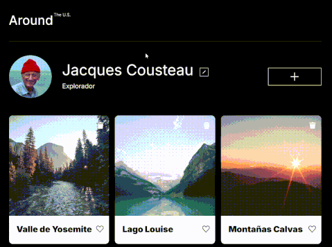
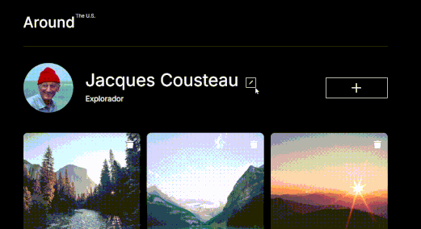

# Tripleten web_project_around

## 📄 Descripción

Este proyecto es una página web con una interfaz tipo perfil de usuario, donde es posible editar datos personales y gestionar una galería de tarjetas (fotos). El diseño es responsivo y el código está modularizado, siguiendo buenas prácticas de HTML, CSS y JavaScript. En esta etapa se incorporó una refactorización aplicando Programación Orientada a Objetos (POO), creando las clases `Card` y `FormValidator` para mejorar la estructura y reutilización del código.

## ⚙️ Funcionalidad

### 👤 Perfil de usuario

- Editar nombre y ocupación mediante un formulario emergente.
- Actualización inmediata del perfil en la interfaz al enviar el formulario.

### 🖼️ Galería de tarjetas

- Visualizar una galería de tarjetas con título e imagen representando distintos lugares.
- Agregar nuevas tarjetas mediante un formulario emergente, con validación básica.
- Las tarjetas nuevas se insertan dinámicamente en la parte superior del grid.

### 💬 Interacciones en tarjetas

- Dar "like" a una tarjeta (con cambio visual de estado activo).
- Eliminar tarjetas del grid sin recargar la página.
- Ampliar la imagen de una tarjeta al hacer clic, usando un popup de vista previa.

### 💡 Experiencia de usuario

- Diseño completamente responsive.
- Efectos visuales suaves con `hover` y transiciones.
- Envío de formularios con tecla Enter desde cualquier campo.
- Validación de formularios con mensajes de error personalizados.
- Manejo dinámico de eventos según la apertura/cierre de popups.

## 🛠️ Tecnologías utilizadas

- **HTML5** — estructura semántica.
- **CSS3** — diseño responsive, Flexbox, Grid, BEM.
- **JavaScript (POO)** — manipulación del DOM y lógica de interacción.
- **Git** — control de versiones.
- **Normalize.css** — consistencia visual entre navegadores.

## 🖥️ Demo Visual

### 📄 Vista general

Muestra la pantalla principal con el perfil del usuario y la galería de tarjetas.

### ✏️ Editar perfil

Popup para modificar nombre y ocupación.

### ➕ Nuevo lugar

Formulario emergente para agregar una nueva tarjeta.

### 💬 Interacciones de tarjeta

Like, eliminar y vista ampliada de imagen.

## 🌐 GitHub Pages

URL: https://hcarloscb.github.io/web_project_around/src/index.html
